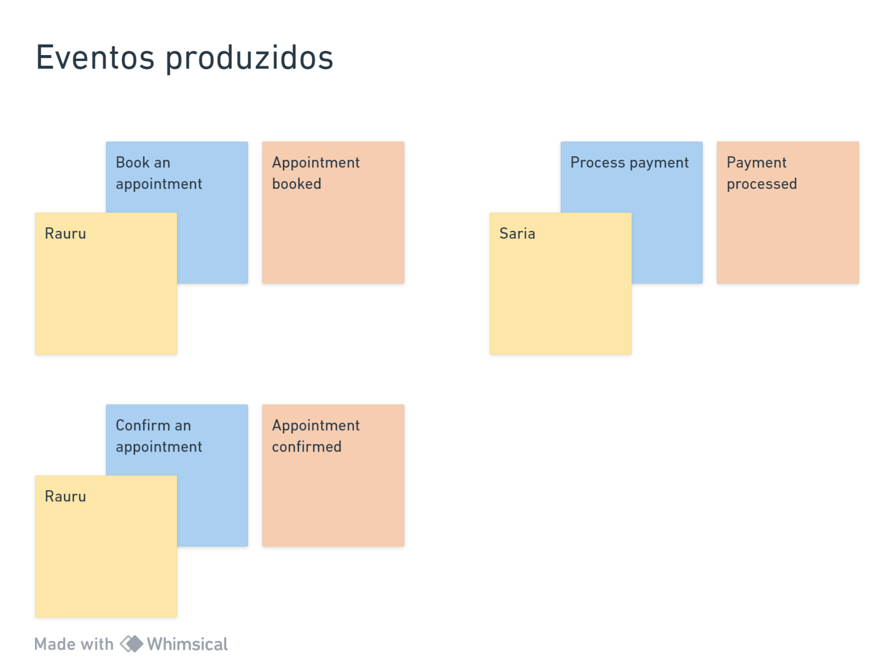
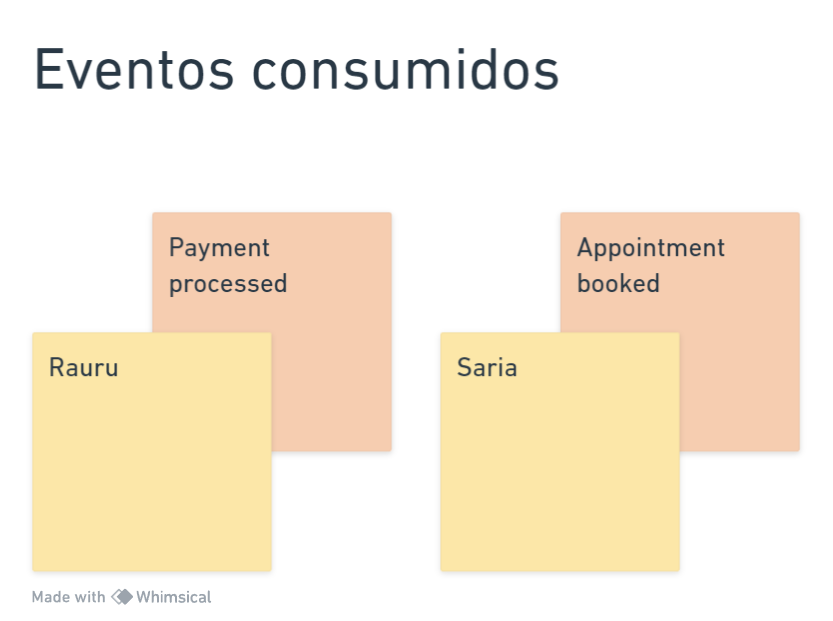

Doctor appointment é sobre marcar consultas médicas.
A ideia desse projeto é demonstrar uma abordagem usando microsserviços.

Microserviços
* [rauru](https://github.com/gsaaraujo/rauru) 
* [saria](https://github.com/gsaaraujo/saria) 
* [darunia](https://github.com/gsaaraujo/darunia) 

### Conceitos utilizados
- [ ] Domain Driven Design
- [ ] Hexagonal Architecture
- [ ] Event Driven Architecture
- [ ] Event Notification
- [ ] CQRS
- [ ] Queue
- [ ] Static Factory Method Pattern
- [ ] Adapter Pattern
- [ ] Repository Pattern
- [ ] Gateway Pattern